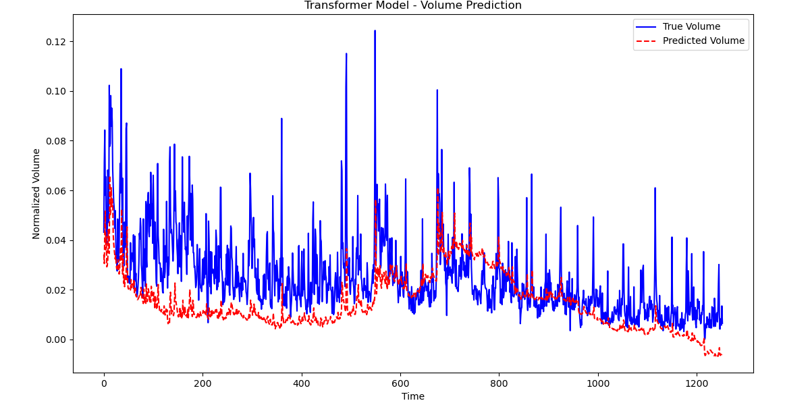

# Stock-Predictor
Deep Learning program based on time sequential models to predict a stock(trading volume and close price) using data over the past years.

In this program, I used the stock of Amazon over the past 25 years as an example to train and test the module, which is based on Transformer, which theoratically can predict any single stock after being trained on a dataset of it.
This model uses the data of the past 60 days to predict one day thereafter, the dependent variables are trading volumn and close price, the independent variables are open price, close price and trading volumn of the past 60 days respectfully.

## **CAUTION**: **You are NOT supposed to run this program on a PC WITHOUT A DISCRETE GRAPHIC.**
---

---
data_source: <a href='https://www.kaggle.com/datasets/meharshanali/amazon-stocks-2025'>Kaggle</a>

---

---
## ture value vs. predicted value

### tranformer_v1

---
